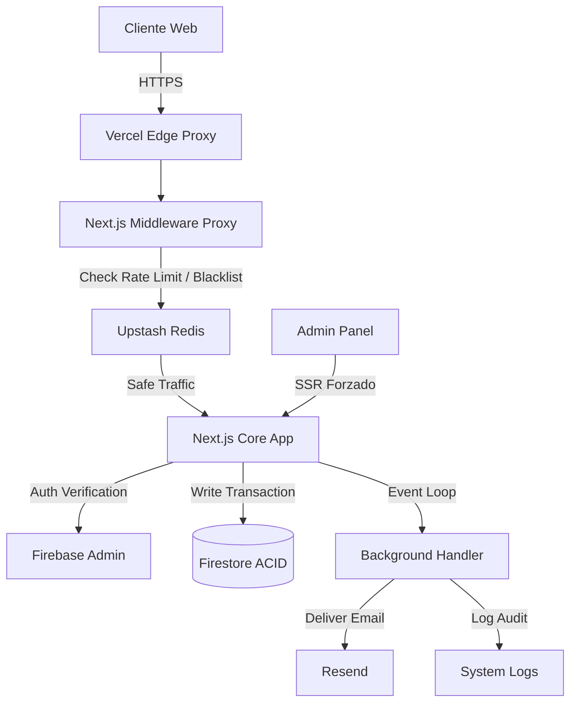
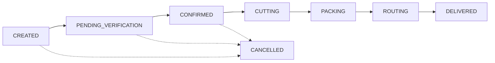

# 📘 Documentación Técnica Completa - El Buen Corte

**Última Actualización**: 24 de Diciembre de 2024  
**Versión**: 2.5  
**Estado**: ✅ Producción Hardened (MANDATO-FILTRO)

---

## 📑 Índice

1. [Información General](#información-general)
2. [Stack Tecnológico](#stack-tecnológico)
3. [Arquitectura del Sistema](#arquitectura-del-sistema)
4. [Funcionalidades Implementadas](#funcionalidades-implementadas)
5. [**Sistema de Manejo de Errores (UX)**](#sistema-de-manejo-de-errores-ux) ⭐
6. [Seguridad y Cumplimiento](#seguridad-y-cumplimiento)
7. [API Endpoints](#api-endpoints)
8. [Deployment y Configuración](#deployment-y-configuración)
9. [Mantenimiento y Operaciones](#mantenimiento-y-operaciones)

---

## 📋 Información General

### Descripción del Proyecto

**El Buen Corte** es una plataforma e-commerce especializada en la venta de cortes premium de carne con entrega a domicilio. La aplicación maneja:

- Catálogo de productos cárnicos
- Sistema de pedidos con peso variable
- Facturación electrónica (cumplimiento DIAN Colombia)
- Gestión de rutas de entrega
- Panel administrativo completo
- Sistema de experiencias de usuario (reviews)

### Características Principales

✅ **Peso Variable Inteligente**: Manejo del "Dilema del Carnicero" con precios ajustados.  
✅ **Middleware de Borde**: Rate limiting y Blacklisting vía Upstash Redis.  
✅ **Analítica Pro**: Cohortes, LTV y Dashboard de KPI en tiempo real.  
✅ **Idempotencia Transaccional**: Blindaje contra duplicados y fallos de red.  
✅ **Seguridad Enterprise**: HSTS, CSP endurecida y Sanitización XSS.

---

## 🛠️ Stack Tecnológico

### Frontend

| Tecnología | Versión | Propósito |
|------------|---------|-----------|
| **Next.js** | 16.1.0 (Turbopack) | Framework React con App Router |
| **React** | 19.0.0 | UI Library |
| **TypeScript** | 5.x | Type Safety |
| **Tailwind CSS** | 3.x | Styling |
| **Shadcn/UI** | Latest | Component Library |
| **Framer Motion** | 11.x | Animaciones |
| **React Hook Form** | 7.x | Formularios |
| **Zod** | 3.x | Validación de schemas |

### Backend

| Tecnología | Versión | Propósito |
|------------|---------|-----------|
| **Firebase Auth** | 11.x | Autenticación |
| **Firestore** | 11.x | Base de datos NoSQL |
| **Firebase Admin SDK** | 13.x | Operaciones server-side |
| **Vercel Blob** | Latest | Almacenamiento de imágenes |
| **Upstash Redis** | Latest | Rate limiting |
| **Resend** | Latest | Emails transaccionales |

### Monitoreo y Seguridad

| Tecnología | Versión | Propósito |
|------------|---------|-----------|
| **Sentry** | 8.x | Error tracking |
| **Google Analytics** | 4 | Analytics |
| **Firebase Remote Config** | 0.x | Feature flags |

### Deployment

| Servicio | Propósito |
|----------|-----------|
| **Vercel** | Hosting y CI/CD |
| **Firebase Hosting** | Backup/CDN |
| **GitHub** | Control de versiones |

---

## 🏗️ Arquitectura del Sistema

### Estructura de Directorios

```
El-buen-corte--main/
├── src/
│   ├── app/                    # Next.js App Router
│   │   ├── api/               # API Routes
│   │   │   ├── admin/        # Endpoints admin
│   │   │   ├── orders/       # Gestión de pedidos
│   │   │   ├── products/     # Gestión de productos
│   │   │   └── upload/       # Subida de archivos
│   │   ├── admin/            # Páginas admin (SSR)
│   │   └── (public)/         # Páginas públicas
│   ├── components/           # Componentes React
│   │   ├── ui/              # Componentes base (Shadcn)
│   │   └── admin/           # Componentes admin
│   ├── hooks/               # Custom React Hooks
│   ├── lib/                 # Utilidades
│   │   ├── firebase.ts     # Firebase Admin
│   │   ├── logger.ts       # Sistema de logging
│   │   ├── sanitizer.ts    # Sanitización XSS
│   │   └── rate-limiter.ts # Rate limiting
│   ├── schemas/            # Schemas Zod
│   ├── types/              # TypeScript types
│   └── middleware.ts       # Next.js middleware
├── docs/                   # Documentación
├── __tests__/             # Tests
├── public/                # Assets estáticos
├── firestore.rules        # Reglas de seguridad
└── next.config.ts         # Configuración Next.js
```

### Flujo de Datos



---

## ✨ Funcionalidades Implementadas

### 1. Sistema de Productos

#### Características

- **Catálogo Dinámico**: Productos cargados desde Firestore
- **Peso Variable**: Soporte para productos con peso aproximado
- **Precio Fijo**: Opción de venta por pieza
- **Imágenes Optimizadas**: Next/Image con Vercel Blob
- **Stock en Tiempo Real**: Actualización automática

#### Campos de Producto

```typescript
interface Product {
  id: string;
  name: string;
  category: string;
  pricePerKg: number;
  stock: number;
  images: ProductImage[];
  
  // Peso Variable
  isFixedPrice: boolean;
  weightLabel?: string;      // "Aprox. 900g - 1.1kg"
  minWeight?: number;        // 0.9 kg
  maxWeight?: number;        // 1.1 kg
  averageWeight?: number;    // 1.0 kg
  fixedPrice?: number;       // Precio fijo de la pieza
  
  // Detalles
  details?: {
    origen?: string;
    maduracion?: string;
    grasa?: string;
    corte?: string;
  };
  pairing?: string;
  badge?: string;
}
```

### 2. Sistema de Pedidos

#### Estados del Pedido

```typescript
type OrderStatus = 
  | 'CREATED'              // Pedido creado, esperando pago
  | 'PENDING_VERIFICATION' // Pago enviado, pendiente verificación
  | 'CONFIRMED'            // Pago confirmado
  | 'CUTTING'              // En proceso de corte
  | 'PACKING'              // Empacando
  | 'ROUTING'              // En ruta de entrega
  | 'DELIVERED'            // Entregado
  | 'CANCELLED';           // Cancelado
```

#### Flujo del Pedido



### 3. Facturación Electrónica

#### Cumplimiento DIAN Colombia

- **Checkbox Condicional**: "Requiero Factura Electrónica"
- **Campos Requeridos**:
  - NIT
  - Razón Social
  - Email de facturación
- **Validación**: Zod schema con regex para NIT
- **Proceso**: Factura individual en 48 horas o factura global diaria

### 4. Generador de Rutas

#### Endpoint: `/api/admin/generate-route`

**Funcionalidad**:
- Filtra pedidos en estado `PACKING`
- Genera texto formateado para WhatsApp
- Calcula total a cobrar
- Optimiza orden de paradas

**Formato de Salida**:
```
📅 RUTA DE LA TARDE - 19 DIC
===================================
📦 PARADA 1: Juan Pérez
📍 Dirección: Calle 123 #45-67, Apto 202
🏘️ Barrio: Chapinero
🏙️ Ciudad: Bogotá
📞 Tel: 3001234567
💰 COBRAR: $50,000
📝 Notas: Dejar en portería
-----------------------------------
📊 RESUMEN DE RUTA
Total paradas: 5
Total a cobrar: $250,000
```

### 5. Panel Administrativo

#### Páginas Admin (SSR Forzado)

```typescript
// Todas las páginas admin tienen:
export const dynamic = 'force-dynamic';
export const revalidate = 0;
```

**Páginas**:
- `/admin/dashboard` - Vista general
- `/admin/orders` - Gestión de pedidos
- `/admin/products` - Gestión de productos
- `/admin/experiences` - Moderación de reviews

#### Características Admin

- ✅ Datos en tiempo real (SSR)
- ✅ Búsqueda y filtrado avanzado
- ✅ Cambio de estado de pedidos
- ✅ Generación de rutas
- ✅ Indicadores visuales de facturación
- ✅ Estadísticas y KPIs

---

## 🎯 Sistema de Manejo de Errores (UX)

### Filosofía de Diseño

**El Buen Corte** implementa un sistema de manejo de errores centrado en la experiencia del usuario, siguiendo estos principios:

1. **Claridad**: Mensajes en español, sin jerga técnica
2. **Accionabilidad**: Siempre indicar qué hacer a continuación
3. **Consistencia**: Mismo diseño visual en toda la app
4. **Empatía**: Tono amigable, nunca culpar al usuario
5. **Contexto**: Explicar por qué ocurrió el error

### Componente Toast Unificado

#### Ubicación: `src/hooks/use-toast.ts`

```typescript
interface ToastOptions {
  type: 'success' | 'error' | 'info' | 'warning';
  title?: string;
  message: string;
  duration?: number;
}

// Uso:
toast({
  type: 'error',
  title: 'Error al Procesar Pago',
  message: 'No pudimos verificar tu comprobante. Por favor, envíalo nuevamente por WhatsApp.',
  duration: 5000
});
```

#### Diseño Visual

| Tipo | Color | Icono | Duración |
|------|-------|-------|----------|
| `success` | Verde | ✅ | 3s |
| `error` | Rojo | ❌ | 5s |
| `warning` | Naranja | ⚠️ | 4s |
| `info` | Azul | ℹ️ | 3s |

### Códigos de Error HTTP y Mensajes UX

#### 400 - Bad Request

**Contexto**: Datos inválidos enviados por el usuario

```typescript
// ❌ MAL (Mensaje técnico)
return NextResponse.json(
  { error: 'Invalid request body' }, 
  { status: 400 }
);

// ✅ BIEN (Mensaje amigable)
return NextResponse.json(
  { 
    error: 'Datos Incompletos',
    message: 'Por favor, completa todos los campos requeridos antes de continuar.',
    fields: ['customerName', 'customerPhone']
  }, 
  { status: 400 }
);
```

**Mensaje en UI**:
```
❌ Datos Incompletos
Por favor, completa todos los campos requeridos antes de continuar.
```

#### 401 - Unauthorized

**Contexto**: Usuario no autenticado

```typescript
// ✅ Mensaje amigable
return NextResponse.json(
  { 
    error: 'Sesión Expirada',
    message: 'Tu sesión ha expirado. Por favor, inicia sesión nuevamente.',
    action: 'redirect_login'
  }, 
  { status: 401 }
);
```

**Mensaje en UI**:
```
🔒 Sesión Expirada
Tu sesión ha expirado. Redirigiendo al inicio de sesión...
```

#### 403 - Forbidden

**Contexto**: Usuario sin permisos admin

```typescript
// ✅ Mensaje amigable
return NextResponse.json(
  { 
    error: 'Acceso Denegado',
    message: 'No tienes permisos para acceder a esta sección. Contacta al administrador si crees que esto es un error.',
  }, 
  { status: 403 }
);
```

**Mensaje en UI**:
```
🚫 Acceso Denegado
No tienes permisos para acceder a esta sección.
Contacta al administrador si crees que esto es un error.
```

#### 404 - Not Found

**Contexto**: Recurso no encontrado

```typescript
// ✅ Mensaje amigable
return NextResponse.json(
  { 
    error: 'Producto No Encontrado',
    message: 'El producto que buscas ya no está disponible o fue eliminado.',
    suggestion: 'Explora nuestro catálogo actualizado'
  }, 
  { status: 404 }
);
```

**Mensaje en UI**:
```
🔍 Producto No Encontrado
El producto que buscas ya no está disponible o fue eliminado.
💡 Explora nuestro catálogo actualizado
```

#### 429 - Too Many Requests

**Contexto**: Rate limiting activado

```typescript
// ✅ Mensaje amigable
return NextResponse.json(
  { 
    error: 'Demasiadas Solicitudes',
    message: 'Has realizado muchas acciones en poco tiempo. Por favor, espera un momento antes de intentar nuevamente.',
    retryAfter: 60
  }, 
  { status: 429 }
);
```

**Mensaje en UI**:
```
⏱️ Demasiadas Solicitudes
Has realizado muchas acciones en poco tiempo.
Por favor, espera 1 minuto antes de intentar nuevamente.
```

#### 500 - Internal Server Error

**Contexto**: Error del servidor

```typescript
// ✅ Mensaje amigable
return NextResponse.json(
  { 
    error: 'Error del Servidor',
    message: 'Algo salió mal de nuestro lado. Nuestro equipo ha sido notificado y estamos trabajando en solucionarlo.',
    errorId: errorId // Para soporte
  }, 
  { status: 500 }
);
```

**Mensaje en UI**:
```
⚠️ Error del Servidor
Algo salió mal de nuestro lado. Nuestro equipo ha sido notificado.
Por favor, intenta nuevamente en unos minutos.

Código de error: ERR-A1B2C3 (para soporte)
```

### Errores de Validación (Zod)

#### Ejemplo: Formulario de Checkout

```typescript
// Schema con mensajes personalizados
const CustomerInfoSchema = z.object({
  customerName: z
    .string()
    .min(3, 'El nombre debe tener al menos 3 caracteres')
    .max(100, 'El nombre es demasiado largo')
    .regex(/^[a-zA-ZáéíóúÁÉÍÓÚñÑ\s]+$/, 'Solo se permiten letras y espacios'),
  
  customerPhone: z
    .string()
    .regex(/^3\d{9}$/, 'Ingresa un número de celular válido (10 dígitos, inicia con 3)'),
  
  customerEmail: z
    .string()
    .email('Ingresa un email válido')
    .optional(),
});
```

**Mensaje en UI**:
```
❌ Número de Celular Inválido
Ingresa un número de celular válido (10 dígitos, inicia con 3)

Ejemplo: 3001234567
```

### Errores de Red

#### Timeout

```typescript
// Manejo de timeout
try {
  const controller = new AbortController();
  const timeoutId = setTimeout(() => controller.abort(), 10000);
  
  const response = await fetch('/api/orders/create', {
    signal: controller.signal
  });
  
  clearTimeout(timeoutId);
} catch (error) {
  if (error.name === 'AbortError') {
    toast({
      type: 'error',
      title: 'Conexión Lenta',
      message: 'La solicitud está tardando más de lo esperado. Verifica tu conexión a internet e intenta nuevamente.'
    });
  }
}
```

#### Sin Conexión

```typescript
// Detección de conexión
if (!navigator.onLine) {
  toast({
    type: 'warning',
    title: 'Sin Conexión',
    message: 'No tienes conexión a internet. Por favor, verifica tu conexión y vuelve a intentar.'
  });
  return;
}
```

### Errores de Negocio

#### Stock Insuficiente

```typescript
// Validación de stock
if (product.stock < quantity) {
  toast({
    type: 'warning',
    title: 'Stock Insuficiente',
    message: `Solo tenemos ${product.stock} unidades disponibles de ${product.name}. Ajusta la cantidad en tu carrito.`
  });
}
```

#### Peso Fuera de Rango

```typescript
// Validación de peso
if (selectedWeight < product.minWeight) {
  toast({
    type: 'error',
    title: 'Peso Muy Bajo',
    message: `El peso mínimo para ${product.name} es ${product.minWeight}kg. Por favor, ajusta la cantidad.`
  });
}
```

### Estados de Carga

#### Skeleton Loaders

```typescript
// Componente de carga
{isLoading ? (
  <div className="grid grid-cols-3 gap-4">
    {[...Array(6)].map((_, i) => (
      <Card key={i} className="animate-pulse">
        <div className="h-48 bg-gray-200 rounded" />
        <div className="h-4 bg-gray-200 rounded mt-2" />
      </Card>
    ))}
  </div>
) : (
  <ProductGrid products={products} />
)}
```

#### Botones con Estado

```typescript
<Button 
  disabled={isSubmitting}
  className="w-full"
>
  {isSubmitting ? (
    <>
      <Loader2 className="mr-2 h-4 w-4 animate-spin" />
      Procesando...
    </>
  ) : (
    'Confirmar Pedido'
  )}
</Button>
```

### Logging y Monitoreo

#### Integración con Sentry

```typescript
// src/lib/logger.ts
export async function logError(
  message: string,
  error: unknown,
  context?: Record<string, any>
) {
  // Log a Sentry
  if (process.env.NODE_ENV === 'production') {
    Sentry.captureException(error, {
      tags: { component: context?.component },
      extra: context
    });
  }
  
  // Log a Firestore para auditoría
  await adminDb.collection('logs').add({
    level: 'error',
    message,
    error: error instanceof Error ? error.message : String(error),
    context,
    timestamp: new Date().toISOString()
  });
}
```

### Mejores Prácticas Implementadas

#### ✅ DO (Hacer)

```typescript
// 1. Mensajes claros y accionables
toast({
  type: 'error',
  title: 'Error al Subir Imagen',
  message: 'La imagen es demasiado grande. El tamaño máximo es 5MB. Intenta con una imagen más pequeña.'
});

// 2. Validación en frontend Y backend
const schema = z.object({
  email: z.string().email('Email inválido')
});

// 3. Manejo de errores específicos
try {
  await createOrder(data);
} catch (error) {
  if (error.code === 'INSUFFICIENT_STOCK') {
    toast({ type: 'warning', message: 'Stock insuficiente' });
  } else if (error.code === 'PAYMENT_FAILED') {
    toast({ type: 'error', message: 'Error en el pago' });
  } else {
    toast({ type: 'error', message: 'Error inesperado' });
  }
}
```

#### ❌ DON'T (No Hacer)

```typescript
// 1. Mensajes técnicos
toast({
  type: 'error',
  message: 'Error: ECONNREFUSED at fetch()' // ❌
});

// 2. Errores genéricos
catch (error) {
  toast({ type: 'error', message: 'Error' }); // ❌
}

// 3. Sin contexto
toast({
  type: 'error',
  message: 'Algo salió mal' // ❌
});
```

---

## 🔐 Seguridad y Cumplimiento

### Capas de Seguridad Implementadas

#### 1. Autenticación y Autorización

- **Firebase Auth**: Tokens JWT verificados
- **Admin Claims**: Custom claims para roles
- **Middleware**: Verificación en cada request

#### 2. Validación de Datos

- **Zod Schemas**: Validación estricta en frontend y backend
- **Sanitización**: Prevención de XSS con `sanitizer.ts`
- **Type Safety**: TypeScript en todo el código

#### 3. Rate Limiting

- **Upstash Redis**: Límites por IP
- **Configuración**:
  - Pedidos: 5 por hora
  - API general: 100 por minuto

#### 4. Headers de Seguridad

```typescript
// next.config.ts
headers: [
  {
    key: 'Strict-Transport-Security',
    value: 'max-age=63072000; includeSubDomains; preload'
  },
  {
    key: 'Content-Security-Policy',
    value: "default-src 'self'; script-src 'self' 'unsafe-eval' 'unsafe-inline'..."
  },
  {
    key: 'X-Frame-Options',
    value: 'DENY'
  },
  {
    key: 'X-Content-Type-Options',
    value: 'nosniff'
  }
]
```

#### 5. Firestore Rules

```javascript
rules_version = '2';
service cloud.firestore {
  match /databases/{database}/documents {
    // Zero Trust: Deny all by default
    match /{document=**} {
      allow read, write: if false;
    }
    
    // Orders: Solo lectura limitada, escritura vía Admin SDK
    match /orders/{orderId} {
      allow read: if isAdmin() || (isAuth() && request.auth.uid == resource.data.userId);
      allow create: if false; // Solo vía Admin SDK
      allow update, delete: if isAdmin();
    }
    
    // Products: Lectura pública, escritura admin
    match /products/{productId} {
      allow read: if true;
      allow write: if isAdmin();
    }
  }
}
```

---

## 🌐 API Endpoints

### Públicos

| Endpoint | Método | Descripción |
|----------|--------|-------------|
| `/api/products/list` | GET | Lista todos los productos |
| `/api/orders/create` | POST | Crea un nuevo pedido |
| `/api/orders/status/[id]` | GET | Consulta estado de pedido |

### Admin (Requieren Auth)

| Endpoint | Método | Descripción |
|----------|--------|-------------|
| `/api/admin/generate-route` | POST | Genera ruta de entrega |
| `/api/orders/list` | GET | Lista todos los pedidos |
| `/api/orders/update` | POST | Actualiza pedido |
| `/api/products/create` | POST | Crea producto |
| `/api/products/update` | POST | Actualiza producto |
| `/api/products/delete` | POST | Elimina producto |

---

## 🚀 Deployment y Configuración

### Variables de Entorno Requeridas

Ver archivo completo: [`.env.example`](file:///e:/VELENOS/Desktop/El-buen-corte--main/.env.example)

**Críticas**:
- `NEXT_PUBLIC_FIREBASE_*` - Configuración Firebase
- `FIREBASE_ADMIN_*` - Firebase Admin SDK
- `SENTRY_DSN` - Monitoreo de errores
- `UPSTASH_REDIS_*` - Rate limiting
- `BLOB_READ_WRITE_TOKEN` - Almacenamiento de imágenes

### Proceso de Deployment

1. **Configurar Variables en Vercel**
2. **Deploy Firestore Rules**: `firebase deploy --only firestore:rules`
3. **Build y Deploy**: `vercel --prod`
4. **Verificar**: Probar flujo completo

---

## 🔧 Mantenimiento y Operaciones

### Monitoreo

- **Sentry**: Errores en tiempo real
- **Vercel Analytics**: Performance
- **Firebase Console**: Uso de base de datos

### Backup

- **Firestore**: Exportación automática diaria
- **Código**: GitHub con protección de rama main

### Actualizaciones

- **Dependencias**: Revisar semanalmente
- **Security Patches**: Aplicar inmediatamente
- **Features**: Según roadmap

---

**Documento mantenido por**: Equipo de Desarrollo El Buen Corte  
**Próxima revisión**: 19 de Enero de 2025
