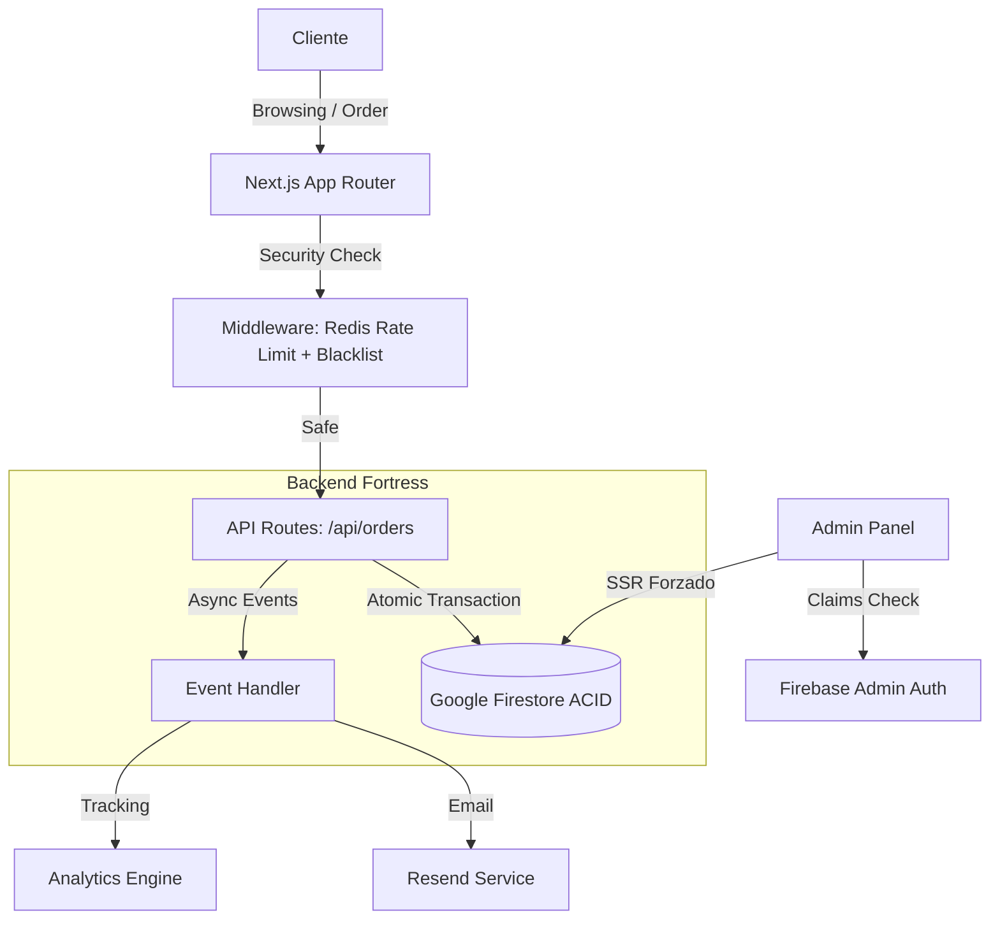

# 🥩 El Buen Corte: Radiografía Completa del Proyecto 🚀
**Versión**: 2.5.0 (Production Hardened)
**Fecha**: 24 de Diciembre, 2025
**Estado**: ✅ Desplegado y Operativo

Este documento constituye la **Radiografía Definitiva** del proyecto. Sirve como informe técnico, operativo y estratégico para inversores, desarrolladores y gerencia.

---

## 🏛️ 1. Visión Arquitectónica (MANDATO-FILTRO)

"El Buen Corte" es una plataforma de e-commerce de ingeniería avanzada diseñada bajo el paradigma **Serverless Core**. No es solo una tienda; es un sistema de gestión distribuido que prioriza la **seguridad proactiva** y la **integridad de datos**.

### 🏗️ Diagrama de Flujo del Ecosistema

---

## 🛡️ 2. Los 4 Pilares del Blindaje (Security & Reliability)

Basado en el protocolo **MANDATO-FILTRO**, el proyecto implementa seguridad de grado empresarial:

1.  **Integridad Transaccional (ACID)**: El sistema utiliza transacciones atómicas para evitar condiciones de carrera. El stock se verifica y descuenta en una sola operación indivisible.
2.  **Defensa de Borde (Middleware)**: Implementación de **Upstash Redis** para:
    *   **Rate Limiting**: Previene ataques de fuerza bruta y spam de pedidos.
    *   **IP Blacklisting**: Bloqueo instantáneo de IPs detectadas por el sistema Honeypot.
    *   **Seguridad de Headers**: HSTS, CSP endurecida, X-Frame-Options y Anti-MIME sniffing.
3.  **Observabilidad Forense**: Sistema de logs centralizado que registra cada transición de estado, error del servidor o intento de acceso no autorizado con metadatos contextuales (IP, User-Agent).
4.  **Resiliencia "Fail-Open"**: En caso de caída de servicios externos (como Redis), el sistema está diseñado para seguir operando (priorizando disponibilidad) sin comprometer la base de datos central.

---

## 📈 3. Motor de Inteligencia de Negocio (Analytics)

El proyecto incluye un motor de analítica avanzado que transforma pedidos en insights:

*   **Análisis de Cohortes**: Visualización del % de retención de clientes mes a mes.
*   **Customer LTV (Lifetime Value)**: Cálculo automático de cuánto valor aporta cada cliente a largo plazo.
*   **Cierre de Caja Diario**: KPIs en tiempo real de ventas, pedidos entregados y efectivo en caja.
*   **Semáforo de Expiración**: Alerta visual para pedidos pendientes de pago por más de 1 hora, optimizando la rotación de inventario.

---

## 🥩 4. Solución al "Dilema del Carnicero" (Peso Variable)

A diferencia de un e-commerce estándar, este sistema maneja la complejidad de los productos frescos:
*   **Rangos de Peso**: El cliente elige un producto con un peso aproximado (ej: 900g - 1.1kg).
*   **Precios Dinámicos vs Fijos**: Soporta tanto el cobro por kg real como el precio fijo por pieza, garantizando que el "cliente nunca pierda".
*   **Logística Inteligente**: Generador de rutas automático para WhatsApp que consolida paradas, direcciones y montos a cobrar para el mensajero.

---

## 🛠️ 5. Stack Tecnológico de Elite

| Componente | Tecnología | Razón del Uso |
| :--- | :--- | :--- |
| **Framework** | **Next.js 15+ (App Router)** | Renderizado híbrido (SSR/SSG) y APIs optimizadas. |
| **Lenguaje** | **TypeScript** | Eliminación de errores en tiempo de ejecución. |
| **Base de Datos** | **Firestore** | Latencia mínima y escalabilidad elástica. |
| **Caché/Security** | **Upstash Redis** | Almacenamiento distribuido de alta velocidad. |
| **UI System** | **Shadcn/UI + Framer** | Interfaz premium que genera confianza inmediata. |
| **Validación** | **Zod** | Esquemas estrictos de entrada/salida de datos. |

---

## 🚀 6. Roadmap: Hacia el Siguiente Nivel

### Corto Plazo:
*   **Cloud Function Sync**: Automatizar la liberación de stock de pedidos expirados.
*   **PWA**: Instalación en móviles para notificaciones push de ofertas.

### Largo Plazo:
*   **Predicción de Demanda**: IA para predecir qué cortes se venderán más el fin de semana.
*   **Pasarela Multi-checkout**: Integración de pagos automáticos (Stripe/Wompi).

---

## 🎯 Conclusión
**El Buen Corte** no es solo software; es un activo digital escalable, seguro y optimizado para la rentabilidad. Representa el estándar de oro en aplicaciones modernas de e-commerce especializado.

---
*Documentación generada bajo el protocolo MANDATO-FILTRO - El Buen Corte v2.5*
