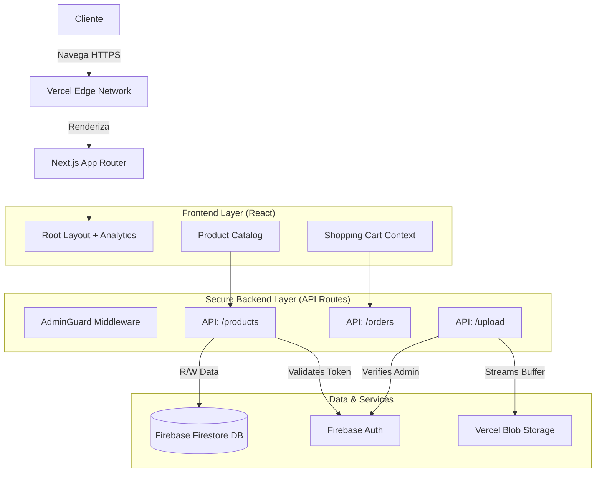

# 🥩 Radiografía del Proyecto: El Buen Corte
**Versión**: 1.0.0 (Beta Release)
**Fecha**: 10 de Diciembre, 2025

Este documento técnico sirve como "Estado del Arte" del proyecto para presentación a inversores y equipo técnico.

---

## 1. Resumen Ejecutivo
"El Buen Corte" no es solo una página web, es una **Plataforma de E-commerce Serverless** diseñada para escalar sin costos fijos de infraestructura. Combina una interfaz de usuario premium (shadcn/ui) con un backend robusto (Next.js + Firebase Admin) para gestionar productos, pedidos e inventario en tiempo real.

### Estado Actual (MVP Robusto)
- **Frontend**: 100% Funcional. Completamente responsivo (Móvil/Desktop).
- **Backend**: API Routes seguras implementadas.
- **Base de Datos**: Firestore conectado en vivo.
- **Seguridad**: Zod Schema Validation + Firebase Auth (Zero Trust).
- **Testing**: Jest Test Suite configurada (Infrastructure Ready).
- **CI/CD**: GitHub Actions pipeline activo.

---

## 2. Arquitectura del Sistema

---

## 3. Flujo Crítico de Negocio

### A. Creación de Producto (Admin)
1.  **Autenticación**: Admin se loguea en `/admin/login`.
    *   *Seguridad*: Token JWT validado en cada request.
2.  **Carga de Datos**: Formulario con validación en tiempo real (Zod).
    *   *Inputs*: Nombre, Precio (Numérico), Categoría.
3.  **Gestión de Imágenes**:
    *   Usuario selecciona archivo -> API `/api/upload/blob` -> Vercel Blob -> Retorna URL pública.
4.  **Persistencia**:
    *   Datos + URL Imagen -> API `/api/products/create` -> Firestore Collection `products`.

### B. Compra de Cliente (User)
1.  **Exploración**: Catálogo público (`/`) obtiene datos de `/api/products/list`.
2.  **Carrito**: Estado local persistente.
3.  **Checkout**:
    *   Cliente confirma -> API `/api/orders/create` (Trazabilidad).
    *   Redirección a WhatsApp con mensaje pre-formateado.

---

## 4. Stack Tecnológico (La "Fórmula Secreta")

| Capa | Tecnología | Justificación |
| :--- | :--- | :--- |
| **Framework** | **Next.js 15 (App Router)** | SEO nativo, velocidad de carga y API integrada. |
| **UI Library** | **Shadcn/UI + Tailwind** | Diseño estético profesional, accesible y ligero. |
| **Base de Datos** | **Google Firestore** | NoSQL, tiempo real, escalado infinito gratuito inicial. |
| **Storage** | **Vercel Blob** | Almacenamiento de imágenes optimizado para el Edge. |
| **Auth** | **Firebase Authentication** | Seguridad de grado bancario sin mantener servidores propios. |
| **Validación** | **Zod** | Garantiza que nunca entren datos corruptos al sistema. |
| **Testing** | **Jest + RTL** | Estándar de la industria para pruebas unitarias. |

---

## 5. Próximos Pasos para Inversión (Roadmap)

### Fase A: Profesionalización (Lo que falta para "Amazon")
- **Pasarela de Pagos**: Integrar Stripe/MercadoPago directamente.
- **Dashboard Analítico**: Gráficos de ventas en `/admin/dashboard` (Actualmente lista plana).
- **Emails Transaccionales**: Confirmación automática de pedidos (Resend.com).

### Fase B: Escala Masiva
- **App Móvil**: Convertir PWA (Progressive Web App).
- **Multi-tenant**: Soportar múltiples sucursales con inventarios independientes.

---

Este proyecto está construido sobre cimientos sólidos. Es una base escalable lista para recibir tráfico real.
