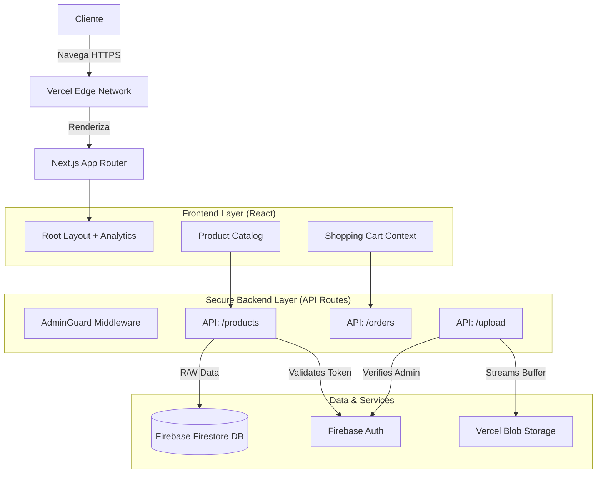

# ォ Radiograf铆a del Proyecto: El Buen Corte
**Versi贸n**: 1.0.0 (Beta Release)
**Fecha**: 10 de Diciembre, 2025

Este documento t茅cnico sirve como "Estado del Arte" del proyecto para presentaci贸n a inversores y equipo t茅cnico.

---

## 1. Resumen Ejecutivo
"El Buen Corte" no es solo una p谩gina web, es una **Plataforma de E-commerce Serverless** dise帽ada para escalar sin costos fijos de infraestructura. Combina una interfaz de usuario premium (shadcn/ui) con un backend robusto (Next.js + Firebase Admin) para gestionar productos, pedidos e inventario en tiempo real.

### Estado Actual (Release Candidate)
- **Dashboard Administrativo**: Panel premium con anal铆tica de retenci贸n, LTV y System Logs.
- **Backend Robusto**: Transacciones ACID, desacoplamiento por eventos y auditor铆a persistente.
- **DevOps**: CI/CD configurado con GitHub Actions y Husky.
- **Base de Datos**: Firestore con Triggers y Reglas de Seguridad estrictas.
- **Seguridad**: Autenticaci贸n Centralizada (Firebase Admin) + Prevenci贸n XSS.
- **Moderaci贸n**: Panel de Experiencias operativo con moderaci贸n en tiempo real.

---

## 2. Arquitectura del Sistema

```mermaid
graph TD
    User[Cliente] -->|Navega HTTPS| CDN[Vercel Edge Network]
    CDN -->|Renderiza| Next[Next.js App Router]
    
    subgraph "Frontend Layer (React)"
        Layout[Root Layout + Analytics]
        Page[Product Catalog]
        Cart[Shopping Cart Context]
    end
    
    subgraph "Secure Backend Layer (API Routes)"
        Auth[AdminGuard Middleware]
        ProductsAPI[API: /products]
        OrdersAPI[API: /orders]
        UploadAPI[API: /upload]
    end
    
    subgraph "Data & Services"
        Firestore[(Firebase Firestore DB)]
        Blob[Vercel Blob Storage]
        AuthService[Firebase Auth]
    end

    Next --> Layout
    Page --> ProductsAPI
    Cart --> OrdersAPI
    
    ProductsAPI -->|Validates Token| AuthService
    ProductsAPI -->|R/W Data| Firestore
    
    UploadAPI -->|Streams Buffer| Blob
    UploadAPI -->|Verifies Admin| AuthService
```

---

## 3. Flujo Cr铆tico de Negocio

### A. Creaci贸n de Producto (Admin)
1.  **Autenticaci贸n**: Admin se loguea en `/admin/login`.
    *   *Seguridad*: Token JWT validado en cada request.
2.  **Carga de Datos**: Formulario con validaci贸n en tiempo real (Zod).
    *   *Inputs*: Nombre, Precio (Num茅rico), Categor铆a.
3.  **Gesti贸n de Im谩genes**:
    *   Usuario selecciona archivo -> API `/api/upload/blob` -> Vercel Blob -> Retorna URL p煤blica.
4.  **Persistencia**:
    *   Datos + URL Imagen -> API `/api/products/create` -> Firestore Collection `products`.

### B. Compra de Cliente (User)
1.  **Exploraci贸n**: Cat谩logo p煤blico optimizado (Carga infinita/Lazy loading).
2.  **Carrito**: Estado global (Context API) con sincronizaci贸n de pesos y precios.
3.  **Checkout**:
    *   **Idempotencia**: Prevenci贸n de pedidos duplicados.
    *   **Segregaci贸n**: Redirecci贸n a seguimiento p煤blico (Read-only status).
    *   **Conversi贸n**: Integraci贸n con WhatsApp Business.

---

## 4. Stack Tecnol贸gico (La "F贸rmula Secreta")

| Capa | Tecnolog铆a | Justificaci贸n |
| :--- | :--- | :--- |
| **Framework** | **Next.js 15 (App Router)** | SEO nativo, velocidad de carga y API integrada. |
| **UI Library** | **Shadcn/UI + Tailwind** | Dise帽o est茅tico profesional, accesible y ligero. |
| **Base de Datos** | **Google Firestore** | NoSQL, tiempo real, escalado infinito gratuito inicial. |
| **Storage** | **Vercel Blob** | Almacenamiento de im谩genes optimizado para el Edge. |
| **Auth** | **Firebase Authentication** | Seguridad de grado bancario sin mantener servidores propios. |
| **Validaci贸n** | **Zod** | Garantiza que nunca entren datos corruptos al sistema. |
| **Testing** | **Jest + RTL** | Est谩ndar de la industria para pruebas unitarias. |

---

## 5. Pr贸ximos Pasos para Inversi贸n (Roadmap)

### Fase A: Profesionalizaci贸n (Lo que falta para "Amazon")
- **Pasarela de Pagos**: Integrar Stripe/MercadoPago directamente.
- **Dashboard Anal铆tico**: Gr谩ficos de ventas en `/admin/dashboard` (Actualmente lista plana).
- **Emails Transaccionales**: Confirmaci贸n autom谩tica de pedidos (Resend.com).

### Fase B: Escala Masiva
- **App M贸vil**: Convertir PWA (Progressive Web App).
- **Multi-tenant**: Soportar m煤ltiples sucursales con inventarios independientes.

---

Este proyecto est谩 construido sobre cimientos s贸lidos. Es una base escalable lista para recibir tr谩fico real.
